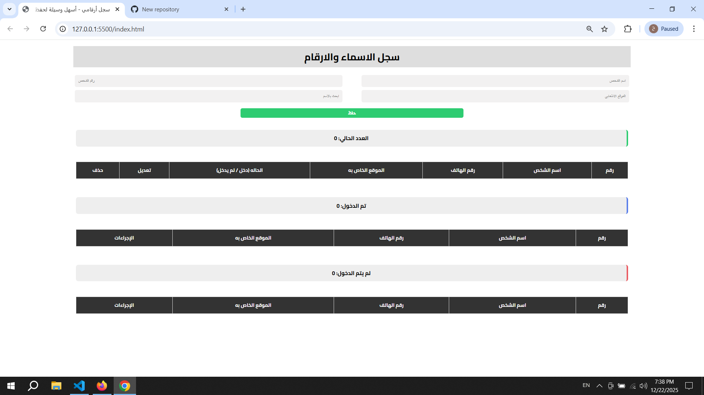
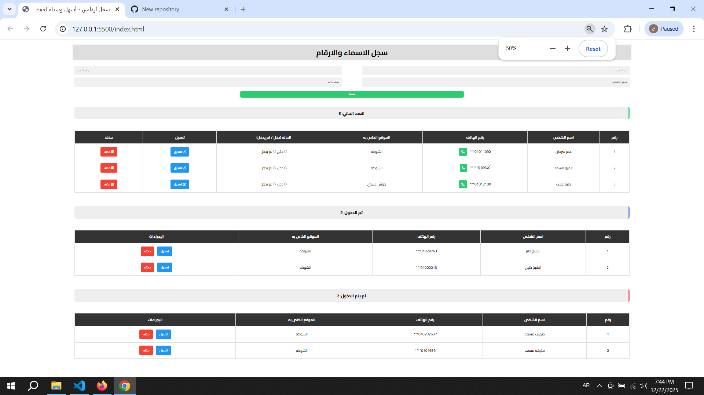

# 🗳️ Smart Voter & Contact Manager
> A professional web-based tool for managing election contacts and tracking entry status with real-time logic.

## 📌 Project Overview
This project was built to solve the problem of managing large lists of voters or contacts. It provides a clean interface to categorize people into three stages: **Pending**, **Entered**, and **Not Entered**, with built-in data protection.

## ✨ Key Features
* **🎯 Mandatory Name Logic:** Ensures every record has a name while keeping other details optional.
* **🚫 Smart Duplicate Prevention:** A custom algorithm checks both Name and Phone across all tables before saving.
* **🔍 Live Search:** Instant filtering system to find any contact by name in milliseconds.
* **📱 Fully Responsive:** Works perfectly on mobile phones, tablets, and desktops.
* **💾 Local Persistence:** All your data is saved in the browser's `localStorage`.

## 📸 Visual Preview
| Initial State (Empty) | Active Management (Full Data) |
| :---: | :---: |
|  |  |

## 🛠️ Technical Stack
* **Logic:** Vanilla JavaScript (ES6+)
* **Styling:** CSS3 (Flexbox & Custom Animations)
* **Structure:** HTML5
* **Icons:** FontAwesome 6

## 🚀 How to Run
1. Download the project files.
2. Open `index.html` in any modern web browser.
3. No installation or server required!

---
Developed with ❤️ for better data management.
